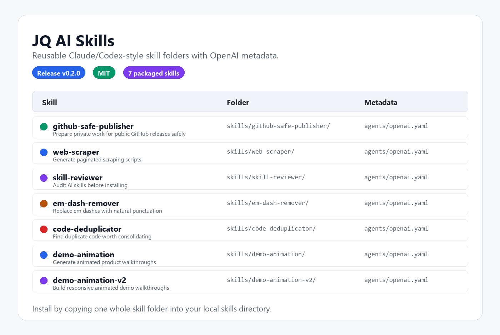
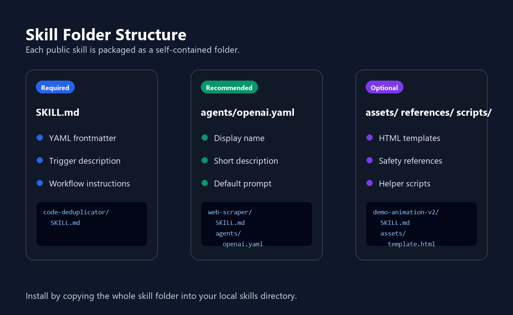
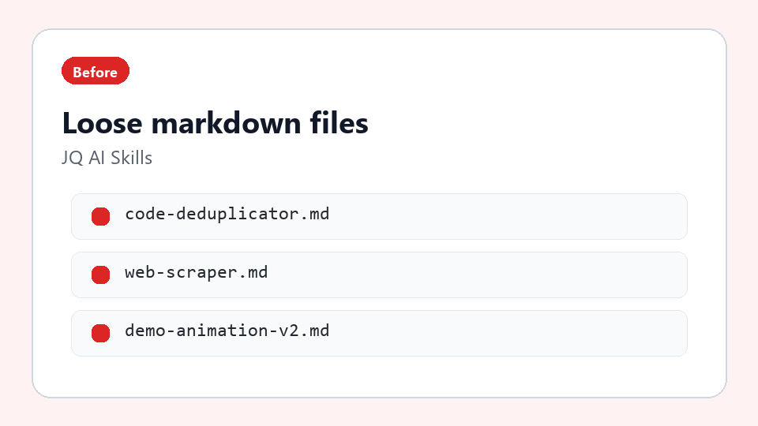
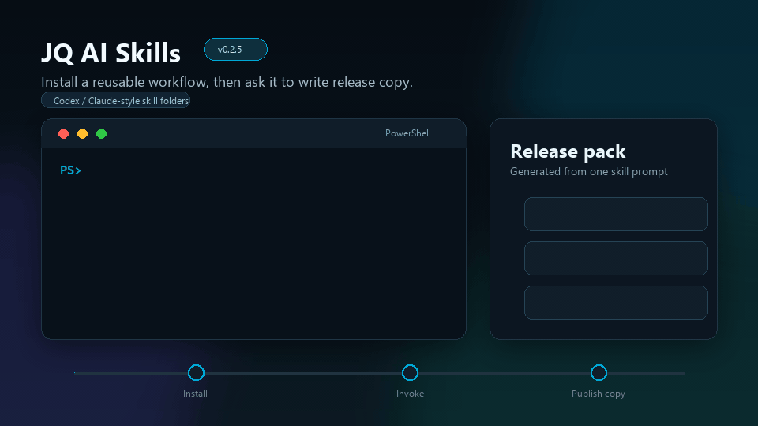

# JQ AI Skills

Reusable AI skills by JQ AI SYSTEMS.

These skills are small, portable instruction folders for Claude/Codex-style workflows. They are published under the MIT License so you can adapt them for your own local setup.

[](https://www.ai.joaoqueiros.com)
[](LICENSE)
[](https://github.com/jqaisystems/jqai-ai-skills/releases/tag/v0.5.8)
[](https://github.com/jqaisystems/jqai-ai-skills/actions/workflows/validate.yml)

New here? Start with [`START_HERE.md`](START_HERE.md) for the shortest path from overview to first skill run. Want to understand the folder contract? Use [`docs/guides/skill-anatomy.md`](docs/guides/skill-anatomy.md). Reviewing a skill before install? Use [`docs/guides/skill-review-checklist.md`](docs/guides/skill-review-checklist.md). Ready to install? Use [`INSTALL.md`](INSTALL.md). Want to confirm it worked? Use [`docs/guides/install-verification.md`](docs/guides/install-verification.md). Something not loading? Use [`TROUBLESHOOTING.md`](TROUBLESHOOTING.md). Want release history? Use [`CHANGELOG.md`](CHANGELOG.md). Publishing a release? Use [`RELEASE_CHECKLIST.md`](RELEASE_CHECKLIST.md). Need safety policy? Use [`SECURITY.md`](SECURITY.md). Planning adoption? Use [`ROADMAP.md`](ROADMAP.md), [`SUPPORT.md`](SUPPORT.md), and the [`skill quality matrix`](docs/skill-quality-matrix.md).

## Preview









### Launch Video


[Watch the 30-second launch video with music](assets/jq-ai-skills-launch-video-with-music.mp4).

The launch video is a promotional preview of the public skill library. Skill installation does not require these media assets.

## Quick Start

If you are new here, start with one skill rather than installing everything:

| If your job is... | Install first | Why |
|---|---|---|
| Public-release safety review | [`github-safe-publisher`](skills/github-safe-publisher/SKILL.md) | Checks sensitive project material before public release. |
| Turning work into public proof | [`case-study-writer`](skills/case-study-writer/SKILL.md) | Converts private project context into a public-safe case study shape. |
| Announcing shipped work | [`release-announcement-writer`](skills/release-announcement-writer/SKILL.md) | Turns changelogs and diffs into release notes, website blurbs, and launch posts. |
| Reviewing third-party skills | [`skill-reviewer`](skills/skill-reviewer/SKILL.md) | Audits skill instructions before you install them locally. |

For install commands, use [`INSTALL.md`](INSTALL.md). Before installing unfamiliar skills, use [`docs/guides/skill-review-checklist.md`](docs/guides/skill-review-checklist.md). After installing, verify the folder, reload, and first prompt with [`docs/guides/install-verification.md`](docs/guides/install-verification.md). If a skill does not appear after install, use [`TROUBLESHOOTING.md`](TROUBLESHOOTING.md). For a guided first install, use [`docs/guides/one-minute-install.md`](docs/guides/one-minute-install.md). For a fuller decision guide, use [`docs/guides/skill-selection.md`](docs/guides/skill-selection.md). For the complete public catalog, use [`docs/catalog.md`](docs/catalog.md). For maturity, examples, and safety notes by skill, use [`docs/skill-quality-matrix.md`](docs/skill-quality-matrix.md).

Install flow:

1. Pick a skill folder from `skills/`.
2. Copy the whole folder into your local skills directory, or use the install scripts below.
3. Restart or reload your AI coding tool.
4. Invoke the skill by name in your prompt.

Example prompts:

```text
Use $github-safe-publisher to prepare this repo for a public release.
Use $case-study-writer to turn this private project summary into a public-safe case study.
Use $outreach-pipeline-designer to design a safe human-reviewed prospecting workflow.
Use $etsy-listing-optimizer to audit and rewrite a marketplace listing safely.
Use $research-brief-curator to turn public links into a safe weekly research brief.
Use $release-announcement-writer to turn this changelog into release notes and a launch post.
Use $skill-reviewer to audit this downloaded skill before installing it.
Use $em-dash-remover to clean this landing page copy.
Use $demo-animation-v2 to create a responsive animated walkthrough.
```

## Example Artifacts

- [`START_HERE.md`](START_HERE.md) is the top-level onboarding path through the repo.
- [`INSTALL.md`](INSTALL.md) is the short command reference for installing one skill, all skills, or a custom test target.
- [`docs/guides/skill-review-checklist.md`](docs/guides/skill-review-checklist.md) helps review permissions, scripts, risky wording, and first-run safety before installing a skill.
- [`docs/guides/install-verification.md`](docs/guides/install-verification.md) confirms an install target, copied folder, reload, and first prompt before real work.
- [`docs/examples/install-smoke-test-sample.md`](docs/examples/install-smoke-test-sample.md) shows a disposable install smoke test with expected terminal checks.
- [`TROUBLESHOOTING.md`](TROUBLESHOOTING.md) helps fix install target, reload, shell, reinstall, and removal issues.
- [`CHANGELOG.md`](CHANGELOG.md) tracks public releases and top-level repo changes.
- [`RELEASE_CHECKLIST.md`](RELEASE_CHECKLIST.md) documents the safe release routine for validation, scanning, tagging, profile updates, website handoff, and live verification.
- [`SECURITY.md`](SECURITY.md) explains responsible use, sensitive issue reporting, install safety, and public publishing boundaries.
- [`ROADMAP.md`](ROADMAP.md) shows the public-safe direction for near-term skill library work.
- [`SUPPORT.md`](SUPPORT.md) explains where to ask for help and what not to post publicly.
- [`docs/skill-quality-matrix.md`](docs/skill-quality-matrix.md) summarizes skill maturity, example coverage, and safety sensitivity.
- [`docs/guides/skill-anatomy.md`](docs/guides/skill-anatomy.md) explains what each required and optional skill folder file does.
- [`docs/catalog.md`](docs/catalog.md) is the complete public catalog of all installable skills, recommended bundles, and safe install defaults.
- [`docs/guides/one-minute-install.md`](docs/guides/one-minute-install.md) shows the fastest path to install one skill, reload your tool, and run a first prompt.
- [`docs/examples/README.md`](docs/examples/README.md) is the index for public-safe samples, workflow bundles, and first-run outputs.
- [`docs/examples/install-smoke-test-sample.md`](docs/examples/install-smoke-test-sample.md) shows the expected shape of a temporary install check before real use.
- [`docs/examples/skill-request-example.md`](docs/examples/skill-request-example.md) shows how to propose a new skill with fictional, public-safe material.
- [`docs/examples/first-run-github-safe-publisher.md`](docs/examples/first-run-github-safe-publisher.md) shows the expected first-run output shape for `github-safe-publisher` using fake files.
- [`docs/examples/skill-reviewer-sample.md`](docs/examples/skill-reviewer-sample.md) shows `READY`, `REVIEW`, and `BLOCK` decisions for fictional skill folders.
- [`docs/examples/workflow-bundles.md`](docs/examples/workflow-bundles.md) shows three practical multi-skill paths: public GitHub publishing, content and research, and demo launch.
- [`docs/examples/github-safe-publisher-sample-review.md`](docs/examples/github-safe-publisher-sample-review.md) shows the `github-safe-publisher` safety verdict, scanner summary, and manual review gate using fake files.
- [`docs/examples/case-study-writer-sample.md`](docs/examples/case-study-writer-sample.md) shows the `case-study-writer` case study shape using a fictional review queue workflow.
- [`docs/examples/research-brief-curator-sample.md`](docs/examples/research-brief-curator-sample.md) shows the `research-brief-curator` output shape using fake public sources and review labels.
- [`docs/examples/release-announcement-writer-sample.md`](docs/examples/release-announcement-writer-sample.md) shows release notes, website copy, and a compact post from a fake changelog.
- [`docs/examples/outreach-pipeline-designer-sample.md`](docs/examples/outreach-pipeline-designer-sample.md) shows a human-reviewed outreach workflow with fake prospects and approval gates.
- [`docs/examples/etsy-listing-optimizer-sample.md`](docs/examples/etsy-listing-optimizer-sample.md) shows a fictional marketplace listing audit with title, tag, description, and safety notes.

## Skill Folder Structure

Each skill is packaged as a self-contained folder:

```text
skill-name/
  SKILL.md
  agents/
    openai.yaml
  assets/       optional templates, images, or reusable files
  references/   optional supporting docs
  scripts/      optional helper scripts
```

For a field-by-field walkthrough, use [`docs/guides/skill-anatomy.md`](docs/guides/skill-anatomy.md). To create a new skill, copy [`skills/_template/`](skills/_template/) and replace the placeholder names, descriptions, and prompts.

## Skills Included

### Safety & Publishing

| Skill | File | Use |
|---|---|---|
| GitHub Safe Publisher | [`skills/github-safe-publisher/SKILL.md`](skills/github-safe-publisher/SKILL.md) | Prepare private work for public GitHub releases safely. |
| Skill Reviewer | [`skills/skill-reviewer/SKILL.md`](skills/skill-reviewer/SKILL.md) | Review AI skill files or folders for dangerous behavior. |

### Public Proof

| Skill | File | Use |
|---|---|---|
| Case Study Writer | [`skills/case-study-writer/SKILL.md`](skills/case-study-writer/SKILL.md) | Turn private project work into public-safe case studies. |
| Release Announcement Writer | [`skills/release-announcement-writer/SKILL.md`](skills/release-announcement-writer/SKILL.md) | Turn changelogs and shipped changes into release notes, website blurbs, and launch posts. |

### Growth & Outreach

| Skill | File | Use |
|---|---|---|
| Outreach Pipeline Designer | [`skills/outreach-pipeline-designer/SKILL.md`](skills/outreach-pipeline-designer/SKILL.md) | Design safe human-reviewed prospecting and outreach workflows. |
| Etsy Listing Optimizer | [`skills/etsy-listing-optimizer/SKILL.md`](skills/etsy-listing-optimizer/SKILL.md) | Audit, rewrite, batch, and monitor marketplace listings. |

### Content & Research

| Skill | File | Use |
|---|---|---|
| Research Brief Curator | [`skills/research-brief-curator/SKILL.md`](skills/research-brief-curator/SKILL.md) | Turn public links and notes into source-aware research briefs with review gates. |
| Web Scraper | [`skills/web-scraper/SKILL.md`](skills/web-scraper/SKILL.md) | Extract public page content safely into structured notes. |
| Em Dash Remover | [`skills/em-dash-remover/SKILL.md`](skills/em-dash-remover/SKILL.md) | Clean one common AI-writing tell from copy. |

### Dev Workflow

| Skill | File | Use |
|---|---|---|
| Code Deduplicator | [`skills/code-deduplicator/SKILL.md`](skills/code-deduplicator/SKILL.md) | Safely consolidate repeated code patterns. |

### Demo & Presentation

| Skill | File | Use |
|---|---|---|
| Demo Animation | [`skills/demo-animation/SKILL.md`](skills/demo-animation/SKILL.md) | Build legacy desktop-oriented product/demo walkthroughs. |
| Demo Animation V2 | [`skills/demo-animation-v2/SKILL.md`](skills/demo-animation-v2/SKILL.md) | Build recommended responsive demo walkthroughs. Includes [`assets/template.html`](skills/demo-animation-v2/assets/template.html). |

## Which Skill Should I Use?

For the fastest guided install, see [`docs/guides/one-minute-install.md`](docs/guides/one-minute-install.md). For the detailed visitor guide, see [`docs/guides/skill-selection.md`](docs/guides/skill-selection.md). To understand the folder contract, see [`docs/guides/skill-anatomy.md`](docs/guides/skill-anatomy.md). To review an unfamiliar skill before install, see [`docs/guides/skill-review-checklist.md`](docs/guides/skill-review-checklist.md). For the complete catalog, see [`docs/catalog.md`](docs/catalog.md).

| If you want to... | Start with |
|---|---|
| Publish private work without leaking secrets | [`github-safe-publisher`](skills/github-safe-publisher/SKILL.md) |
| Turn internal work into client-readable proof | [`case-study-writer`](skills/case-study-writer/SKILL.md) |
| Design a review-first sales or prospecting workflow | [`outreach-pipeline-designer`](skills/outreach-pipeline-designer/SKILL.md) |
| Improve a marketplace listing safely | [`etsy-listing-optimizer`](skills/etsy-listing-optimizer/SKILL.md) |
| Turn public links into a reviewed research brief | [`research-brief-curator`](skills/research-brief-curator/SKILL.md) |
| Package release notes or a launch post | [`release-announcement-writer`](skills/release-announcement-writer/SKILL.md) |
| Review a downloaded skill before installing it | [`skill-reviewer`](skills/skill-reviewer/SKILL.md) |
| Extract structured data from public pages | [`web-scraper`](skills/web-scraper/SKILL.md) |
| Clean AI-ish punctuation from copy | [`em-dash-remover`](skills/em-dash-remover/SKILL.md) |
| Reduce repeated code patterns | [`code-deduplicator`](skills/code-deduplicator/SKILL.md) |
| Build a responsive walkthrough demo | [`demo-animation-v2`](skills/demo-animation-v2/SKILL.md) |
| Build a legacy desktop-only walkthrough demo | [`demo-animation`](skills/demo-animation/SKILL.md) |

## Why This Matters

The skills repo is the technical credibility layer behind the client-facing systems. It shows how JQ AI SYSTEMS packages repeatable AI workflows into reusable instructions, review steps, and safety checks instead of relying on one-off prompts.

## Installation

For the short command reference, see [`INSTALL.md`](INSTALL.md). After installing, confirm the setup with [`docs/guides/install-verification.md`](docs/guides/install-verification.md). If a skill does not show up after install, see [`TROUBLESHOOTING.md`](TROUBLESHOOTING.md).

For Claude Code/Codex-style local skills:

1. Create a local skills folder if you do not already have one.
2. Copy the selected skill folder from `skills/`.
3. Place the whole folder in your local skills directory.
4. Restart or reload your AI coding tool if needed.
5. Ask the tool to use the skill by name.

Only install skills you understand. Review the instructions before using them on private projects.

## Codex Install

Copy a whole skill folder into your Codex skills directory, then restart Codex so the skill list reloads.

Fast install from this repo:

Windows PowerShell:

```powershell
.\install.ps1 github-safe-publisher
.\install.ps1 case-study-writer
.\install.ps1 outreach-pipeline-designer
.\install.ps1 etsy-listing-optimizer
.\install.ps1 research-brief-curator
.\install.ps1 -All
```

macOS/Linux:

```bash
chmod +x ./install.sh
./install.sh github-safe-publisher
./install.sh case-study-writer
./install.sh outreach-pipeline-designer
./install.sh etsy-listing-optimizer
./install.sh research-brief-curator
./install.sh --all
```

List available skills:

```powershell
.\install.ps1 -List
```

```bash
./install.sh --list
```

Manual install:

Windows PowerShell:

```powershell
New-Item -ItemType Directory -Force "$env:USERPROFILE\.codex\skills" | Out-Null
Copy-Item -Recurse -Force ".\skills\web-scraper" "$env:USERPROFILE\.codex\skills\web-scraper"
```

macOS/Linux:

```bash
mkdir -p ~/.codex/skills
cp -R ./skills/web-scraper ~/.codex/skills/web-scraper
```

Then invoke it by name:

```text
Use $web-scraper to build a browser console scraper for this public paginated website.
```

## Contributing

Use [`CONTRIBUTING.md`](CONTRIBUTING.md) for the expected folder format, metadata requirements, safety rules, and pre-submission checklist. For a public-safe proposal shape, use [`docs/examples/skill-request-example.md`](docs/examples/skill-request-example.md).

## Safety Notes

- These files are instructions, not secrets.
- Do not paste private API keys, passwords, tokens, client data, or credentials into prompts unless you fully understand where they will go.
- Use [`SECURITY.md`](SECURITY.md) for responsible-use rules and sensitive issue reporting.
- The `skill-reviewer` skill exists to help inspect third-party skill files before installing them.
- Use [`docs/guides/skill-review-checklist.md`](docs/guides/skill-review-checklist.md) before installing unfamiliar or modified skill folders.
- Run new skills on a test folder before using them in production work.

## License

Released under the [MIT License](LICENSE).

More systems and case studies: [ai.joaoqueiros.com/systems](https://www.ai.joaoqueiros.com/systems)

Want a custom workflow built around your team? Start here: [ai.joaoqueiros.com/contact](https://www.ai.joaoqueiros.com/contact)
